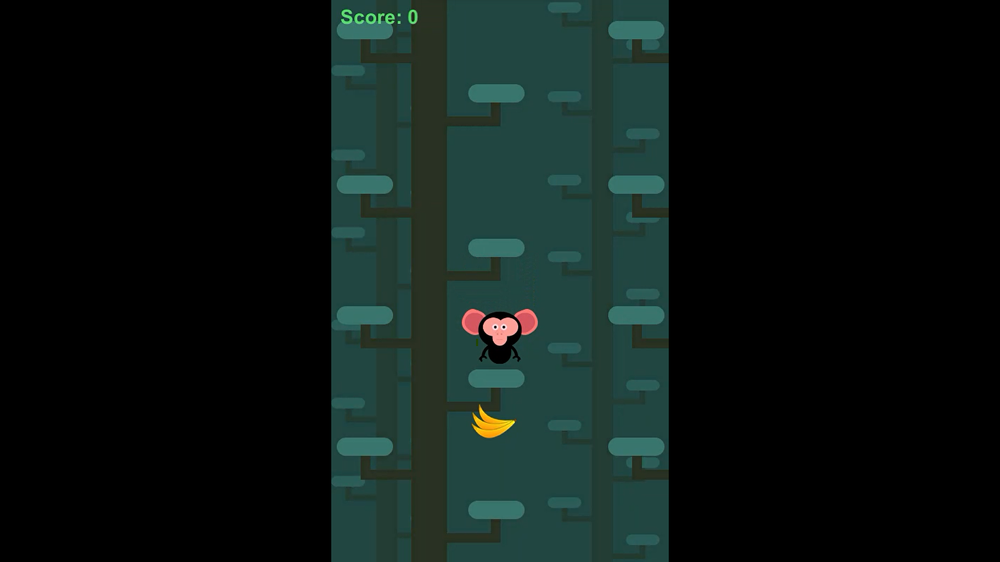
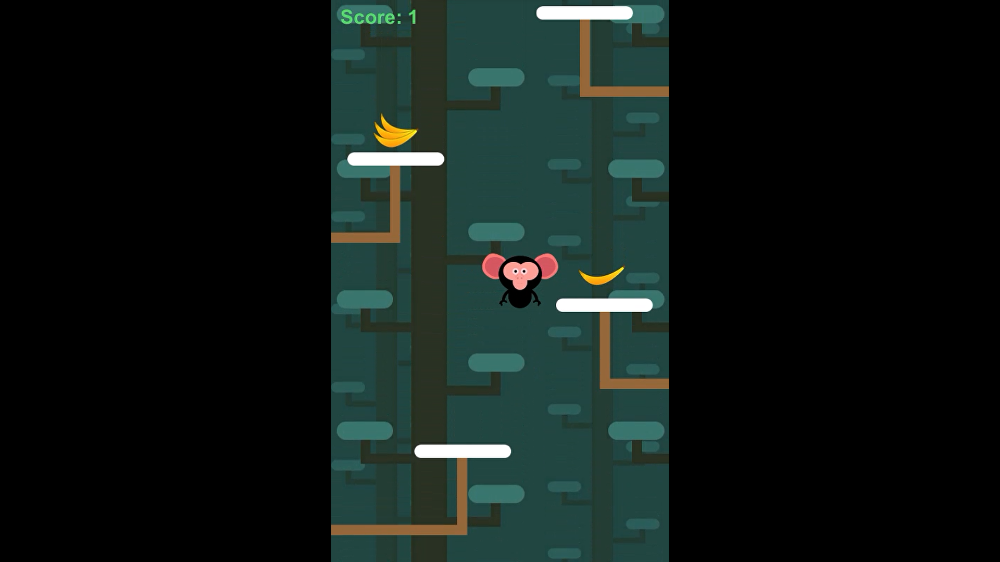
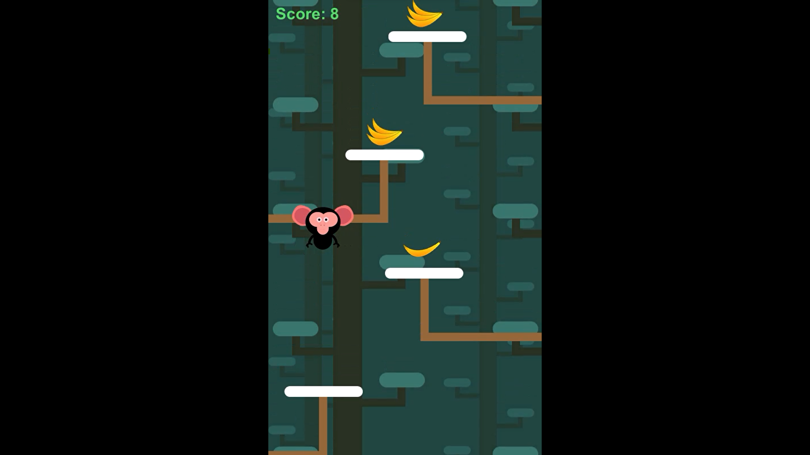
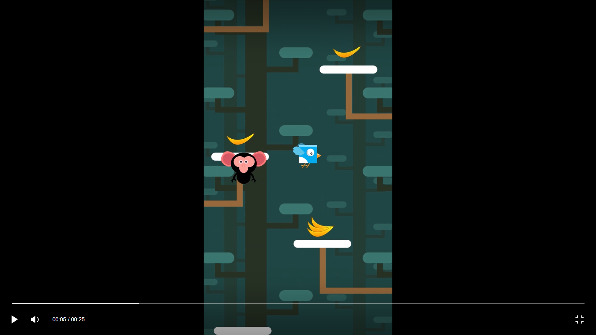

# Banana Jump

### Introduction
    Banana Monkey is a game where the player controls a monkey that jumps between trees to collect bananas. 
    The goal is to gather as many bananas as possible while avoiding birds perched on the branches of the 
    trees.
    
### Features
    - Intuitive Controls:
        - Easy-to-use controls for seamless navigation and jumping between trees.

    - Endless Gameplay:
        - Experience an infinite level design for continuous fun and challenges.

    - Dynamic Obstacles:
        - Encounter challenging birds on tree branches, adding an element of strategy and avoidance.

    - Banana Collection:
        - Collect bananas scattered throughout the game to earn points and achieve high scores.

    - Sound Effects and Music:
        - Immersive audio elements to enhance the overall gaming experience.

    - Score Tracking:
        - Keep track of your banana collection progress with an in-game score display.
    
### Screenshots

   
   
   
   

   
### Implementation and Game Design
#### Implementation
##### Scripts
    - Player: Controls the player's movement, interactions with various objects (bananas and platforms),
            and manages the game state, including player death and restarting the game.
            
    - BGSpawner: Manages the spawning of background objects to create an infinite scrolling effect based on 
            the player's movement. It dynamically repositions background objects when triggered, ensuring a 
            continuous visual experience.
                  
    - Collector: Acts as a collector, deactivating game objects with specific tags 
            (such as "Background," "Platform," "NormalPush," "ExtraPush," or "Bird") upon collision.
    
    - CameraController: Enables the camera to follow the player vertically within a specified threshold. It 
             adjusts its position based on the player's movement, ensuring the player stays within view.
    
    - GameManager: Manages the game state, including restarting the game after a delay. It ensures only one
             instance of the GameManager exists throughout the game.

    - PlatformSpawner: Spawns alternating left and right platforms, adjusting their positions vertically. It 
             also has the ability to spawn birds on random platforms.
             
    - Platform: Represents a platform and dynamically instantiates either a regular banana or a special banana 
             at a designated spawn point when the platform is created. The instantiated banana becomes a child
             of the platform.

    - SoundManager: Manages sound effects for jumping and game over events.
    
### Gameplay Demonstration
    - For a visual demonstration of the gameplay, watch video on YouTube:
 [Youtube video link]([https://youtu.be/AiR1l4ESMho](https://youtube.com/shorts/Mac8FaoEVqU?feature=share)

### Play the Game
    - To experience the game firsthand, play it directly by following this playable link:
[Play in browser(WebGl)](https://rahul-pargi.itch.io/banana-jump)
 

 
